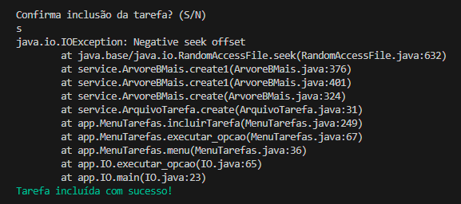

# Trabalho Prático AEDs 3 - Parte 2

## Descrição

Este trabalho é a continuação do desenvolvimento de um sistema CRUD (Create, Read, Update, Delete) genérico, agora com a implementação de índices indiretos e um relacionamento 1:N. A extensão do CRUD foi aplicada a uma entidade específica, deixando de ser genérico. Focamos na implementação de um relacionamento entre duas entidades: **Tarefa** e **Categoria**.

Cada tarefa pertence a uma categoria, e nosso sistema agora oferece suporte para buscar tarefas por categoria, assegurando a integridade das operações ao gerenciar a vinculação entre elas.

## Estrutura Estendida

### Índice Indireto

O índice indireto foi implementado para a entidade **Categoria**, permitindo a busca de categorias não apenas por ID, mas também pelo nome. Utilizamos uma tabela Hash Extensível para gerenciar este índice indireto, sendo que a classe `ParNomeId` foi criada para armazenar o par (Nome, ID). Esse índice facilita operações como a busca e a verificação da existência de uma categoria pelo nome.

### Relacionamento 1:N

O relacionamento 1:N entre categorias e tarefas foi implementado de modo que cada tarefa possui uma **chave estrangeira** representando o **ID da categoria** à qual pertence. Utilizamos uma **Árvore B+** para manter esse relacionamento e assegurar que seja possível recuperar todas as tarefas de uma determinada categoria.

Além disso, a árvore B+ também foi usada para impedir a exclusão de uma categoria que ainda possui tarefas vinculadas, mantendo assim a integridade dos dados.

## Estrutura do Projeto

### Classes Criadas

1. **ArquivoTarefas**: Estende a classe `Arquivo<T>` e gerencia as operações de CRUD para a entidade Tarefa. Implementa o relacionamento 1:N com categorias, utilizando a Árvore B+.
   
2. **ArquivoCategorias**: Estende a classe `Arquivo<Categoria>` e inclui o índice indireto por nome de categoria, utilizando a Árvore B+. Implementa também a verificação de dependências ao tentar excluir uma categoria com tarefas vinculadas.

3. **ParNomeIDCategoria**: Representa o par (Nome, ID) para o índice indireto de categorias.

4. **ParIdCategoriaIdTarefa**: Representa o par (ID de Categoria, ID de Tarefa) para o relacionamento 1:N na Árvore B+.

5. **MenuTarefas e MenuCategorias**: Responsáveis pela interação com o usuário, apresentando menus, capturando entradas e exibindo resultados, além disso também controlam a lógica das operações de CRUD e as interações entre arquivos, visões e o sistema de armazenamento.

### Relatório de Operações

- **Buscar**: Implementa a busca utilizando a árvore.
- **Incluir**: Permite adicionar uma nova categoria ou tarefa, com suas respectivas validações.
- **Alterar**: Permite atualizar uma tarefa ou categoria existente.
- **Excluir**: Realiza verificações antes de permitir a exclusão.

## Experiência de Desenvolvimento

Implementamos todos os requisitos para estender o CRUD, criando tanto o índice indireto quanto o relacionamento 1:N. O maior desafio foi compreender e integrar a Árvore B+ para gerenciar o relacionamento entre categorias e tarefas. Apesar disso, a experiência foi enriquecedora, especialmente ao ver como estruturas de dados como tabelas hash extensíveis e árvores B+ se comportam em um cenário prático.

A integração entre os Menus e os Arquivos seguiu o padrão MVC, o que facilitou a organização do código e a manutenção.

## Checklist

- O CRUD (com índice direto) de categorias foi implementado?  
   ```
   SIM
   ```
   
- Há um índice indireto de nomes para as categorias?  
   ```
   SIM
   ```
   
- O atributo de ID de categoria, como chave estrangeira, foi criado na classe Tarefa?  
   ```
   SIM
   ```
   
- Há uma árvore B+ que registre o relacionamento 1:N entre tarefas e categorias?  
   ```
   SIM
   ```
    
- É possível listar as tarefas de uma categoria?  
   ```
   SIM
   ```
    
- A remoção de categorias checa se há alguma tarefa vinculada a ela?  
   ```
   SIM
   ```
    
- A inclusão da categoria em uma tarefa se limita às categorias existentes?  
   ```
   SIM
   ```
    
- O trabalho está funcionando corretamente?  
   ```
   SIM
   ```
    
- O trabalho está completo?  
   ```
   SIM
   ```
   
- O trabalho é original e não a cópia de um trabalho de outro grupo?  
   ```
   SIM
   ```

## Problema / Erro

Nessa segunda parte do projeto, mais especificamente na utilização da Árvore B+, enfrentamos o seguinte problema: após a
criação da primeira Tarefa, todas as Tarefas seguintes que forem criadas terá um erro de inserção na método `create( )` 
da `ArvoreBMais.java`.

Os passos de testes realizados são:

1. Ir no menu de categorias e criar uma nova categoria.
2. Ir no menu de tarefas e inserir duas novas tarefas.
3. Após isso, é gerado a seguinte mensagem de erro:


## Integrantes

- [Breno Pires](https://www.linkedin.com/in/brenopiressantos/)
- [Caio Faria](https://www.linkedin.com/in/caiofdiniz)
- [Giuseppe Cordeiro](https://www.linkedin.com/in/giuseppecordeiro/)
- [Vinicius Miranda](https://www.linkedin.com/in/vinimiraa/)

## FIM
